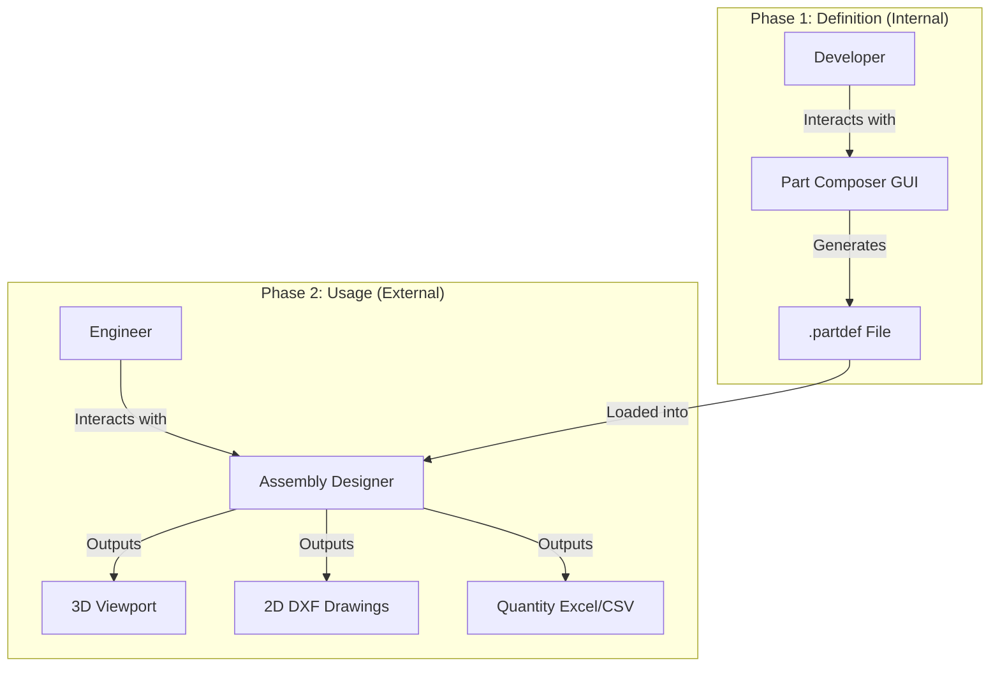

## 4. The "Part Composer" (Developer Workflow)

This tool functions as a **"Macro Recorder"** or **Stack-Based Modeler**. It does not require pre-planning the entire chain; the chain is built step-by-step.

### 4.1. The Workflow

1. **Geometry Creation (The Stack):**
    
    - Developer selects a tool (e.g., `Rectangle`, `Loft`, `Sweep`).
        
    - Developer performs the action in the viewport.
        
    - **System Action:** A new **Operation Step** is added to the History Stack.
        
    - _Example:_ `Step 1: Create Rectangle (W=10, H=10)`.
        
2. **Parameterization (Property Binding):**
    
    - Developer selects a Step in the History Stack.
        
    - The Input Properties for that step are displayed (e.g., `Width`, `Height`).
        
    - Developer renames a property (e.g., `Width` $\rightarrow$ `Footing_Width`) and checks **[x] Is Public**.
        
    - **Visual Feedback:** The developer attaches this parameter to a 3D edge to visualize it as a CAD Dimension.
        
3. **Socket Definition (Interfaces):**
    
    - Developer selects the resulting mesh (Geometric Element).
        
    - Developer clicks specific points (Faces, Centroids) to create **Sockets**.
        
    - _Example:_ Creating a "Top_Center" socket on a Footing to allow a Column to snap to it later.
        
4. **Save:**
    
    - The entire stack and metadata are serialized into JSON.
        

### 4.2. Functional Requirements

- **Primitives:** Point, Line, Rectangle, Circle, Box, Cylinder.
    
- **Procedural:** Loft (Profile-to-Profile), Sweep (Profile-along-Path).
    
- **Boolean:** Union, Subtract (for cuts).
    
- **History Management:** Ability to reorder or delete steps (with dependency warnings).
    

---

## 5. The "Assembly Designer" (User Workflow)

This tool functions as a **BIM Assembler**. Logic flows hierarchically (Parent $\rightarrow$ Child).

### 5.1. The Workflow

1. **Instantiation:**
    
    - User selects a Part (e.g., "T-Wall") from the library.
        
    - Places it in the 3D scene.
        
2. **Assembly (Snapping):**
    
    - User selects a **Child Part** (e.g., Column).
        
    - User activates **"Connect"** mode.
        
    - User clicks a Socket on the Child, then a Socket on the **Parent** (e.g., Footing).
        
    - **System Action:** The Child is aligned (Plane) and translated (Point) to match the Parent. No complex solver is used; it is a direct Parent-Child transform.
        
3. **Modification:**
    
    - User selects a Part.
        
    - The **Property Grid** shows only the _Exposed Parameters_.
        
    - User changes "Height" from 3000 to 5000.
        
    - **System Action:** The underlying Function Chain re-runs, regenerating the mesh instantly.
        
4. **Output Generation:**
    
    - **3D:** Real-time rendering.
        
    - **2D:** Slices the geometry logic to produce clean DXF/DWG (schematic lines, not just mesh projections).
        
    - **Quantity:** Aggregates calculated volumes/areas based on part logic.
        

---

## 6. Data Structure (The JSON Recipe)

The `.partdef` file captures the construction history, not just the final mesh.

```JSON

{
  "Meta": {
    "PartName": "Standard_Pier_Column",
    "Version": "1.0"
  },
  "PublicParameters": [
    { 
      "Name": "Col_Height", 
      "Type": "Double", 
      "Default": 5000, 
      "Description": "Height of the pier column body" 
    }
  ],
  "FunctionChain": [
    {
      "StepID": 1,
      "Operation": "CREATE_CIRCLE",
      "Inputs": { "Radius": 1000, "Plane": "XY" },
      "OutputID": "Ref_Profile_Bottom"
    },
    {
      "StepID": 2,
      "Operation": "EXTRUDE",
      "Inputs": { 
        "TargetProfile": "Ref_Profile_Bottom", 
        "Length": "{Col_Height}"  // BINDING: Uses Exposed Parameter
      },
      "OutputID": "Main_Body_Mesh"
    }
  ],
  "Sockets": [
    {
      "Name": "Top_Connection",
      "AttachedTo": "Main_Body_Mesh",
      "Location": "Face_Top_Centroid",
      "Orientation": "Face_Normal"
    }
  ]
}
```

---
## 7. Technical Implementation Details

### 7.1. Logic & Math

- **No Circular Dependency:** Logic flows strictly linear (Step 1 $\rightarrow$ Step 2) inside a Part, and Hierarchical (Parent $\rightarrow$ Child) inside an Assembly.
    
- **Topological Binding:** Parameters are bound to the _Input Logic_ of a function, not the _Output Vertex IDs_. This prevents the model from breaking if geometry changes significantly (e.g., changing a box to a cylinder doesn't break the "Height" parameter if both functions accept a "Height" input).
    

### 7.2. Geometric Elements (Smart Meshes)

When an operation like `Loft` runs, it returns a `GeometricElement` object containing:

1. **The Mesh:** For rendering.
    
2. **Semantic Data:** References to "Start Cap", "End Cap", and "Side Faces" to allow easier Socket creation.
    

### 7.3. Scope (Phase 1)

- **Included:** Geometry definition, Parametric sizing, Assembly (Socket) linking, basic 2D/Quantity export.
    
- **Excluded (Postponed):** Rebar modeling, Structural Analysis integration, Complex "Solver-based" constraints.
    

---

## 8. Summary of Benefits

1. **Flexibility:** Developers can add new structural types (Parts) simply by creating a JSON recipe, without recompiling the main application.
    
2. **Performance:** Avoiding complex constraint solvers ensures the application remains fast even with large assemblies.
    
3. **Usability:** End-users are protected from breaking the geometry; they interact only with safe, exposed parameters.